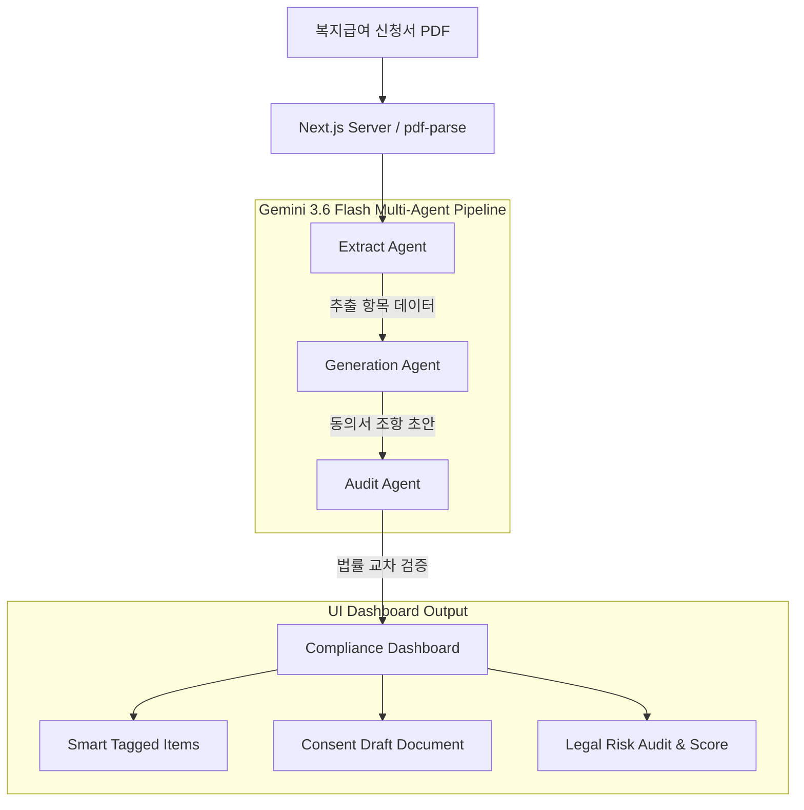

<div align="center">

# 🛡️ 개동췤 (ConSentient)
### 비영리 사회복지 개인정보 컴플라이언스 멀티 에이전트 OS

[](https://nextjs.org/)
[](https://www.typescriptlang.org/)
[](https://tailwindcss.com/)
[](https://ai.google.dev/)
[](#license)

<p align="center">
  <b>복지급여 신청서 PDF 한 장으로 30초 만에 법적으로 검증된 개인정보 수집·이용 동의서를 자동 생성하고 위반 위험을 감사합니다.</b>
</p>

</div>

---

## 📌 목차 (Table of Contents)

- [개요 (Overview)](#-개요-overview)
- [주요 기능 (Key Features)](#-주요-기능-key-features)
- [시스템 아키텍처 (Architecture)](#-시스템-아키텍처-architecture)
- [기술 스택 (Tech Stack)](#-기술-스택-tech-stack)
- [시작하기 (Getting Started)](#-시작하기-getting-started)
- [환경 변수 설정 (Environment Variables)](#-환경-변수-설정-environment-variables)
- [라이선스 및 유의사항 (License & Disclaimer)](#-라이선스-및-유의사항-license--disclaimer)

---

## 💡 개요 (Overview)

비영리 사회복지 현장에서는 복지급여 신청 접수 시 일반 개인정보(성명, 주소, 연락처)뿐만 아니라 **건강 상태, 장애 여부, 소득 수준 등 고도의 민감정보**와 **주민등록번호(고유식별정보)**를 대량 수집합니다.

그러나 전담 법무·개인정보 관리 인력이 부족하여 과거 서식을 무분별하게 재사용하거나 최신 **개인정보보호법(2024~2026 개정)**을 반영하지 못해 법적 과징금 및 유출 위험에 노출되어 있습니다.

**개동췤 (ConSentient)**은 복지사의 업무 부담을 혁신적으로 줄이고 취약계층의 개인정보 인권을 보호하기 위해 개발된 **AI 멀티 에이전트 기반 개인정보 컴플라이언스 솔루션**입니다.

---

## 🌟 주요 기능 (Key Features)

### 1. 📄 복지 신청서 PDF 파싱 & 텍스트 추출
- 복지급여 신청서 PDF 파일을 드래그앤드롭하여 드라이버 없이 실시간 텍스트 구조 파싱
- 샘플 복지 신청서 지원으로 원클릭 체험 가능

### 2. 🤖 3-단계 실시간 멀티 에이전트 파이프라인
Google의 최신 **Gemini 3.6 Flash** 기반 3개 전문 에이전트가 실시간 단계별 체인 형태로 동작합니다.
- **🔵 1단계: 추출 에이전트 (Extract Agent)**
  - 신청서 텍스트에서 개인정보 항목을 식별하고 `일반개인정보`, `민감정보`, `고유식별정보`로 자동 태깅
- **🟣 2단계: 생성 에이전트 (Generation Agent)**
  - 추출된 항목과 당사자 요건(만 14세 미만 여부 등)을 바탕으로 개인정보보호법 맞춤형 동의서 조항 자동 합성
- **🟢 3단계: 감사 에이전트 (Audit Agent)**
  - 최신 법령 체계(PIPA §15, §23, §24 및 가이드라인)를 직접 교차 대조하여 컴플라이언스 준수 점수(0~100점) 및 위험 알림 생성

### 3. 📊 인터랙티브 결과 대시보드
- **스마트 태깅 추출 항목 뷰어**: 카테고리별 개인정보 수집 현황 한눈에 확인
- **생성된 동의서 초안 실시간 서식**: 민감정보 별도 동의란, 법정대리인 동의란이 포함된 표준 서식 제공
- **법적 감사 & 위험 분석 카드**: `위험(Critical)`, `권장(Recommendation)`, `적합(Pass)` 등급별 알림 제공 및 클릭 시 동의서 관련 조항으로 **자동 스크롤 & 하이라이팅**
- **내보내기 기능**: 완성된 동의서 텍스트 복사 및 깔끔한 **PDF 문서 출력 기능** 지원

---

## 🏗️ 시스템 아키텍처 (Architecture)



---

## 🛠️ 기술 스택 (Tech Stack)

| 구분 | 기술 / 라이브러리 |
| :--- | :--- |
| **Framework** | Next.js 16 (App Router, Turbopack) |
| **Language** | TypeScript |
| **Styling** | Tailwind CSS v4, Vanilla CSS (Glassmorphism UI) |
| **AI Engine** | Google Gemini 3.6 Flash (`@google/genai` SDK) |
| **Document Processing** | `pdf-parse` (Custom Page Renderer) |
| **Icons** | Lucide React |

---

## 🚀 시작하기 (Getting Started)

### 필수 조건 (Prerequisites)
- Node.js 18.0.0 이상
- npm 또는 yarn / pnpm

### 설치 및 실행 (Installation)

1. 저장소 클론 (Clone repository):
```bash
git clone https://github.com/bargoLoft/gaedong.git
cd gaedong
```

2. 의존성 패키지 설치 (Install dependencies):
```bash
npm install
```

3. 개발 서버 실행 (Run development server):
```bash
npm run dev
```

4. 브라우저에서 [http://localhost:3000](http://localhost:3000) 접속

---

## 🔑 환경 변수 설정 (Environment Variables)

프로젝트 루트 디렉토리에 `.env.local` 파일을 생성하고 Google AI Studio에서 발급받은 API 키를 입력합니다:

```env
GEMINI_API_KEY=AQ.Ab8... # Google AI Studio Authentication Key
```

> **API 키 발급 방법**: [aistudio.google.com/apikey](https://aistudio.google.com/apikey) 접속 ➔ **Create API key** 클릭 후 발급받은 `AQ.` 키 복사.

---

## 📜 라이선스 및 유의사항 (License & Disclaimer)

- **License**: MIT License
- **Disclaimer**: 본 시스템이 생성하는 동의서 초안 및 법적 감사 결과는 비영리 현장의 업무 지원용 AI 보조 도구입니다. 공식 서식 사용 전 기관의 개인정보 보호책임자(CPO) 또는 법무 담당자의 최종 검토를 권장합니다.

<br />

<div align="center">
  <b>개동췤 (ConSentient) © 2026. All rights reserved.</b>
</div>
